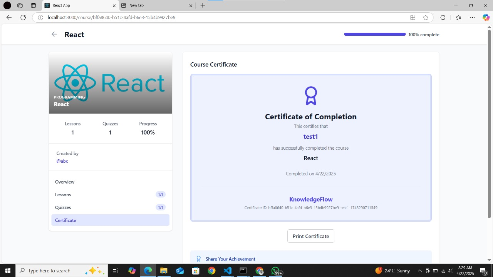
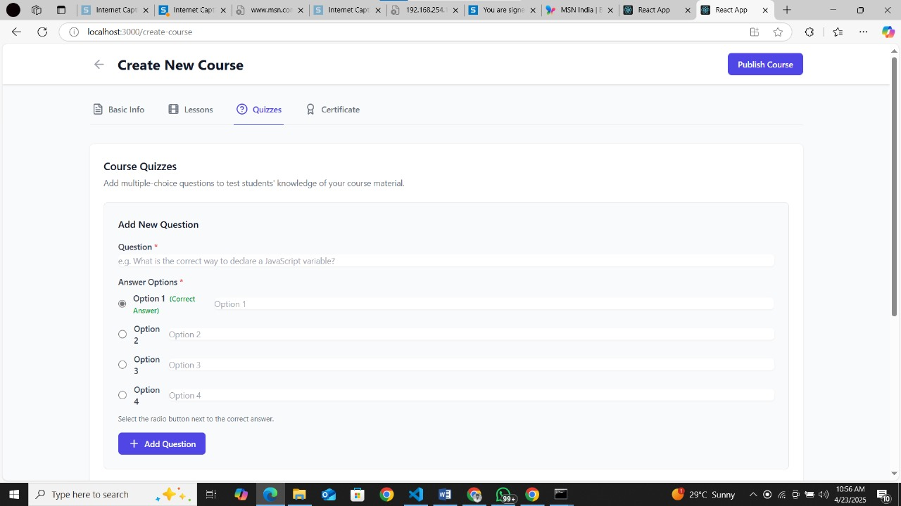

# KnowledgeFlow

**Knowledge Flow** is a full-featured Learning Management System (LMS) designed with two separate web portals for Learners and Instructors. It follows the **Model-View-Controller (MVC)** architecture and is powered by a **Javalin backend**.

---

## Features

- User authentication (learners & instructors)
- Course creation, enrollment & management
- Assignment uploads and grading
- Progress tracking & analytics
- Certification on course completion

---

## Tech Stack

- **Backend:** [Javalin](https://javalin.io/), Java 17+, MVC architecture
- **Frontend:**
  - React, Tailwind CSS
- **Database:** Firebase
- **Build Tool:** Maven 

